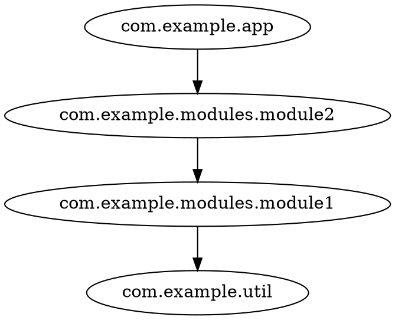

# How to export the graph

`codeps analyze` ends with one of two output formats, selected with `-f/--format`:

| Format | Use case |
|---|---|
| `dot` | Graphviz rendering, static images, `dot -Tsvg` pipelines |
| `mermaid` | Markdown documentation, Mermaid live editors, GitHub markdown |

The graph is first produced in the [common JSON format](/reference/json-input.html) by
`codeps export` — to a file, or to stdout for piping straight into `analyze`.
Output goes to stdout by default; use `-o/--out` to write to a file.

## DOT

```shell
codeps export --from semanticdb classes/META-INF/semanticdb -o deps.json
codeps analyze -g package -f dot -o graph.dot deps.json
dot -Tsvg graph.dot -o graph.svg   # render with graphviz
```



Nodes that have no edges are emitted as standalone lines, so they are not lost.
When the graph has cycles, a `// cycles: a -> b -> a` comment line is added
right after the `digraph deps {` header.

## Mermaid

```shell
codeps export --from semanticdb classes/META-INF/semanticdb | codeps analyze -g package -f mermaid -
```


Node ids are aliased to `N0`, `N1`, ... because Mermaid ids break on dots. When the
graph has cycles, a `%% cycles: a -> b -> a` comment lists them right after the
`flowchart LR` header. Paste the output into any Mermaid renderer (e.g.
[mermaid.live](https://mermaid.live)) or a Markdown file:

````markdown

````

## Keeping large graphs readable

- `-i`/`-e` filter packages in and out (e.g. `-i com.example -e com.example.internal`)
- `-c` collapse rules merge whole subtrees into a single node — `com.example.**` collapses
  everything below `com.example`, `org.lib.*` one level below the prefix — so big graphs
  stay readable; loops created by collapsing are dropped

```shell
codeps analyze -g package -f dot -i com.example -c com.example.modules.** deps.json
```

See [Export formats](/reference/export-formats.html) for format details and
[CLI reference](/reference/cli.html) for filtering and collapsing.
