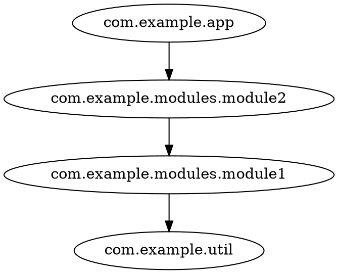
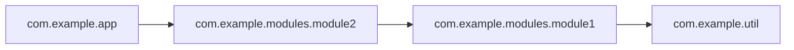
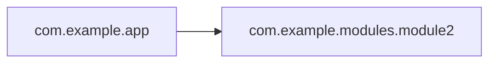

# Exporting graphs

Every `codeps` run ends with one of three export formats, selected with `-f/--format`:

| Format | Use case |
|---|---|
| `dot` | Graphviz rendering, static images, `dot -Tsvg` pipelines |
| `json` | Programmatic consumption, the [interactive demo](/demo/cytoscape-graph.html) |
| `mermaid` | Markdown documentation, Mermaid live editors, GitHub markdown |

Output goes to stdout by default; use `-o/--out` to write to a file.

## DOT

```shell
java -jar codeps.jar semdb classes/META-INF/semanticdb -i com.example -f dot -o graph.dot
dot -Tsvg graph.dot -o graph.svg   # render with graphviz
```



Nodes that have no edges are emitted as standalone lines, so they are not lost.
When the graph has cycles, a `// cycles: a -> b -> a` comment line is added
right after the `digraph deps {` header (the same cycles also appear as a
`%% cycles: ...` comment in Mermaid output and as the `cycles` field in JSON).

## JSON

```shell
java -jar codeps.jar semdb classes/META-INF/semanticdb -i com.example -f json -o graph.json
```

```json
{
  "nodes": ["com.example.app", "com.example.modules.module1", "com.example.modules.module2", "com.example.util"],
  "edges": [["com.example.app", "com.example.modules.module2"], ["com.example.modules.module1", "com.example.util"], ["com.example.modules.module2", "com.example.modules.module1"]],
  "cycles": [],
  "nodeInfo": {
    "com.example.app": {"files": 1, "classes": 1},
    "com.example.modules.module1": {"files": 1, "classes": 1},
    "com.example.modules.module2": {"files": 1, "classes": 1},
    "com.example.util": {"files": 1, "classes": 1}
  }
}
```

- `nodes` — package names (sorted)
- `edges` — pairs `[source, target]` (sorted)
- `cycles` — circular dependencies, each as a closed loop in actual dependency
  order (e.g. `["a", "c", "b", "a"]` means `a -> c -> b -> a`); always present,
  `[]` when the graph is acyclic
- `nodeInfo` — per-package `{files, classes}` stats; only present for SemanticDB input (jdeps has no stats)

This is the format the [interactive demo](/demo/cytoscape-graph.html) consumes — export, then drop the file on the page.

## Mermaid

```shell
java -jar codeps.jar semdb classes/META-INF/semanticdb -i com.example -f mermaid
```



Node ids are aliased to `N0`, `N1`, ... because Mermaid ids break on dots. Paste the output
into any Mermaid renderer (e.g. [mermaid.live](https://mermaid.live)) or a Markdown file:

````markdown

````

See [Export formats](/reference/export-formats.html) for format details.
