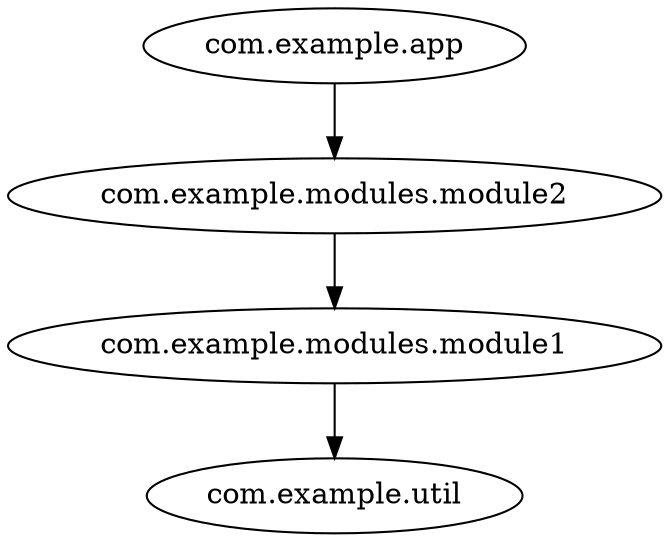

# Export & analyze Java/JVM projects with jdeps

[jdeps](https://docs.oracle.com/en/java/javase/21/docs/specs/man/jdeps.html) is the JDK's own dependency analyzer.
It ships with every JDK, so this workflow needs **no extra tooling** — great for Java projects
or when you can't (or don't want to) enable SemanticDB.
Your build already produced the `.class` files; the only extra step is piping `jdeps` output to a text file.

jdeps data is type-level only: it has no file or member nodes, so on jdeps graphs
`-g type` and `-g member` are the identity, `-g file` behaves like `-g package`
(see the [granularity table](/reference/cli.html#granularity)).

## Generating the input

```shell
jdeps -verbose:class -filter:none -cp classes classes > jdeps.txt
```

- `-verbose:class` is required — codeps reads the indented per-class detail lines
- `-filter:none` keeps all edges (JDK-internal noise like `java.*` can be filtered later with `-e`)

## Exporting the graph

`codeps export` parses the text file and emits the
[common JSON graph format](/reference/json-input.html) (`nodes` + `edges`):

```shell
codeps export --from jdeps jdeps.txt -o deps.json
```

Only the project's own classes appear — the exporter drops edges to external classes
that are not themselves defined in the input.

## Analyzing

`codeps draw` renders the graph at the granularity you pick:

```shell
codeps draw -g type -f dot deps.json
```

or in one pipe:

```shell
codeps export --from jdeps jdeps.txt | codeps draw -g type -f dot -
```

For cycle analysis at every granularity in one run, use `codeps report` —
see the [Cycle analysis report](/reference/report.html).

Example output:



## Filtering JDK noise

The raw `jdeps -verbose:class` output includes edges to `java.*`, `scala.*` and other
platform classes. Exclude them to keep the graph focused on your code:

```shell
codeps draw -g type -f dot -i com.example -e java.** -e scala.** deps.json
```

> Note: excludes are package patterns matched against each node's root package —
> `java.**` collapses everything under `java` (see [Collapse rules](/reference/cli.html#collapse-rules)).

## Collapsing

Just like with SemanticDB input, `-c/--collapse` rules apply:

```shell
codeps draw -g package -f dot -c com.example.modules.** deps.json
```

See [CLI reference](/reference/cli.html) for the full option list.
