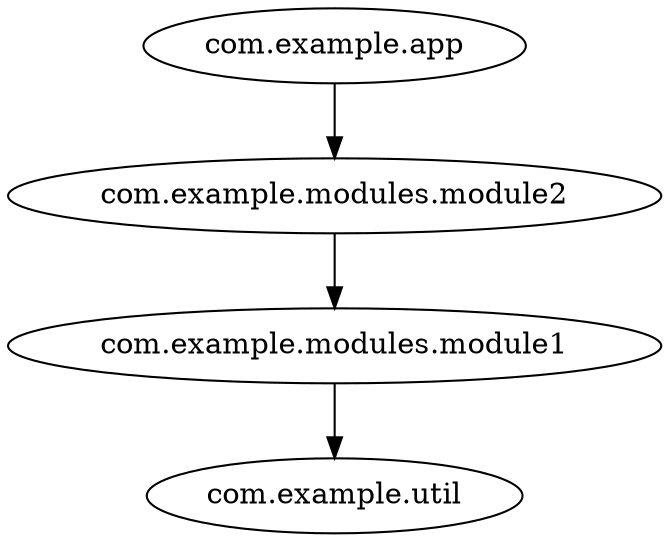

# jdeps analysis

[jdeps](https://docs.oracle.com/en/java/javase/21/docs/specs/man/jdeps.html) is the JDK's own dependency analyzer.
It ships with every JDK, so this workflow needs **no extra tooling** — great for Java projects
or when you can't (or don't want to) enable SemanticDB.

The `jdeps` subcommand parses `jdeps -verbose:package` **text output** and extracts
package-to-package edges. Note that jdeps carries no per-package file/class info,
so the JSON `nodeInfo` stats are omitted for this input.

## Generating the input

```shell
jdeps -verbose:package -filter:none -cp classes classes > jdeps.txt
```

- `-verbose:package` is required — codeps ignores summary lines and reads the indented detail lines
- `-filter:none` keeps all edges (otherwise JDK-internal noise like `java.*` is dropped; you can filter it later with `--exclude`)

The codeps repo ships a checked-in example: `tmp/examples/example1/jdeps.txt`
(generated by tests from the `testFixtures/example1` classes).

## Running the analysis

```shell
deder exec -t run -m cli jdeps jdeps.txt -i com.example -f dot
```

Example, using the fixture in this repo:

```shell
deder exec -t run -m cli jdeps tmp/examples/example1/jdeps.txt -i com.example -f dot
```



## Filtering JDK noise

The raw `jdeps -verbose:package` output includes edges to `java.*`, `scala.*` and other platform packages.
Exclude them to keep the graph focused on your code:

```shell
deder exec -t run -m cli jdeps jdeps.txt -i com.example -e java.** -e scala.** -f json
```

> Note: excludes are package patterns matched against the *source* package of each edge —
> `java.**` collapses everything under `java` (see [Collapse rules](/reference/cli.html#collapse-rules)).

## Collapsing

Just like with SemanticDB input, `-c/--collapse` rules apply:

```shell
deder exec -t run -m cli jdeps jdeps.txt -i com.example -c com.example.modules.** -f dot
```

See [CLI reference](/reference/cli.html) for the full option list.
