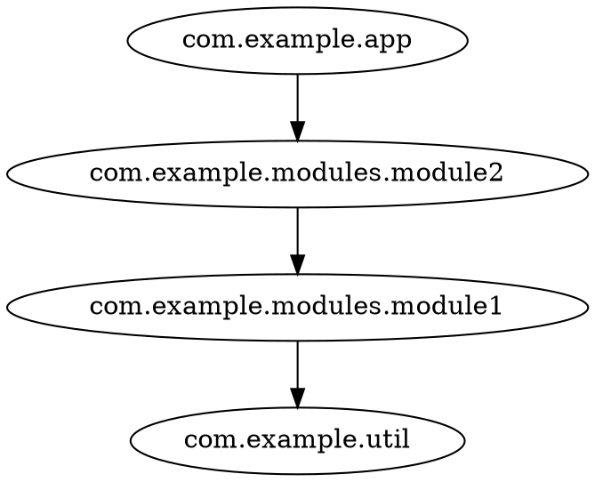

# Export & analyze Scala/SemanticDB projects

SemanticDB is a data format describing the semantic information of Scala (and Java) programs,
produced by the Scala compiler (`-Xsemanticdb` flag) or tools like scala-cli.

Scala data is the richest codeps input: it carries `package`, `file`, `type` and `member`
nodes, so the analyzer can render the graph at any of the four granularities
(`-g package|file|type|member`). Only the project's **own symbols** are exported —
references to external libraries and the JDK are dropped by the exporter.

## Generating SemanticDB files

If your build already emits SemanticDB (scala-cli, sbt or Maven with the `semanticdb` plugin,
plain scalac with `-Xsemanticdb`), the `.semanticdb` files are already on your disk —
the example below is just one way to get them:

With scala-cli:

```shell
scala-cli compile --server=false --semanticdb -d classes src/
```

This writes one `.semanticdb` file per source file under `classes/META-INF/semanticdb/`.

Other ways to get SemanticDB output:

- scalac directly: add `-Xsemanticdb` (and optionally `-P:semanticdb:sourceroot:...`) to your compile flags
- Maven / sbt: enable the `semanticdb` compiler plugin and check the generated files in the target dir

## Exporting the graph

`codeps export` walks the directory, reads every `*.semanticdb` file and emits the
[common JSON graph format](/reference/json-input.html) (`nodes` + `edges`):

```shell
codeps export --from semanticdb classes/META-INF/semanticdb -o deps.json
```

- `--from semanticdb` selects the SemanticDB producer (required)
- the input is a **directory** — the whole tree is walked for `*.semanticdb` files
- `-o deps.json` writes the graph to a file; without `-o` it goes to stdout

Source file ids are made relative to the current working directory; pass `--root <dir>`
to make them relative to `<dir>` instead (e.g. the project root):

```shell
codeps export --from semanticdb classes/META-INF/semanticdb --root . -o deps.json
```

## Analyzing

`codeps analyze` reads the JSON graph and renders it at the granularity you pick:

```shell
codeps export --from semanticdb classes/META-INF/semanticdb -o deps.json
codeps analyze -g package -f dot deps.json
```

- `-g` is the aggregation level — all four are available on SemanticDB data: `package`
  (the classic package view), `file`, `type` or `member`
- `-f` is the output format: `dot` or `mermaid`
- `-i`/`-e`/`-c` filter and collapse, e.g. `-i com.example` keeps only your packages

No intermediate file needed — pipe `export` straight into `analyze` (the `-` tells
`analyze` to read the JSON from stdin):

```shell
codeps export --from semanticdb classes/META-INF/semanticdb | codeps analyze -g type -f mermaid -
```

Example `-g package` output:



Circular dependencies are reported as `// cycles:` / `%% cycles:` comments in the output
(see [Export formats](/reference/export-formats.html)).

## Filtering and collapsing

`--include`/`--exclude` take package patterns: a pattern `com.example` matches the package
itself and everything below it; excludes win over includes.

```shell
# only com.example packages, no third-party or JDK noise
codeps analyze -g package -f dot -i com.example deps.json

# com.example.* minus internal helpers
codeps analyze -g package -f dot -i com.example -e com.example.internal deps.json
```

Collapse rules merge whole subtrees into a single node, which keeps big graphs readable:

```shell
codeps analyze -g package -f dot -i com.example -c com.example.modules.** deps.json
```

When multiple rules match, the longest prefix wins; loops created by collapsing are dropped.
See [CLI reference](/reference/cli.html) for the full option list.
