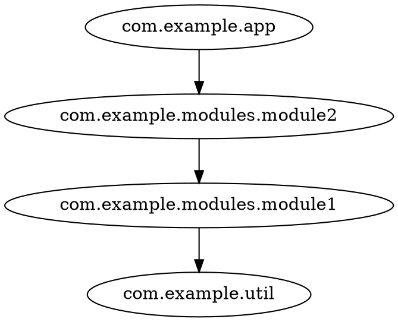

# SemanticDB analysis

SemanticDB is a data format describing the semantic information of Scala (and Java) programs,
produced by the Scala compiler (`-Xsemanticdb` flag) or tools like scala-cli.

The `semdb` subcommand walks a directory, reads every `*.semanticdb` file, and extracts:

- **own packages** — packages defined in the analyzed sources
- **package edges** — for every symbol reference, an edge `own package -> referenced package`
- **stats** — per package: number of source files and number of class-like types (classes, objects, traits)

## Generating SemanticDB files

If your build already emits SemanticDB (scala-cli, sbt or Maven with the `semanticdb` plugin,
plain scalac with `-Xsemanticdb`), the `.semanticdb` files are already on your disk —
the example below is just one way to get them:

With scala-cli:

```shell
scala-cli compile --server=false --semanticdb -d classes src/
```

This writes one `.semanticdb` file per source file under `classes/META-INF/semanticdb/`.

Other ways to get SemanticDB output:

- scalac directly: add `-Xsemanticdb` (and optionally `-P:semanticdb:sourceroot:...`) to your compile flags
- Maven / sbt: enable the `semanticdb` compiler plugin and check the generated files in the target dir

## Running the analysis

```shell
java -jar codeps.jar semdb <dir-with-semanticdb> -i com.example -f dot
```

- `<dir-with-semanticdb>` is a positional argument — the whole directory tree is walked for `.semanticdb` files
- `-i/--include` keeps only your packages (see [filtering](#filtering))
- `-f/--format` selects the output format: `dot`, `json` or `mermaid`

Example:

```shell
java -jar codeps.jar semdb classes/META-INF/semanticdb -i com.example -f dot
```



The JSON format also includes per-package stats (`nodeInfo`), which the
[interactive demo](/demo/cytoscape-graph.html) can display on nodes (file/class counts):

```json
{
  "nodes": ["com.example.app", "com.example.modules.module1"],
  "edges": [["com.example.app", "com.example.modules.module2"]],
  "cycles": [],
  "nodeInfo": {
    "com.example.app": {"files": 1, "classes": 1}
  }
}
```

Circular dependencies show up in the `cycles` field as closed loops in actual
dependency order (e.g. `["a", "c", "b", "a"]` means `a -> c -> b -> a`; `[]` when
the graph is acyclic) and as `// cycles:` / `%% cycles:` comments in DOT and
Mermaid output.

## Filtering

`--include` and `--exclude` take package patterns: a pattern `com.example` matches the package itself
and everything below it. Excludes win over includes.

```shell
# only com.example packages, no third-party or JDK noise
java -jar codeps.jar semdb classes/META-INF/semanticdb -i com.example -f json

# com.example.* minus internal helpers
java -jar codeps.jar semdb classes/META-INF/semanticdb -i com.example -e com.example.internal -f json
```

## Collapsing

Collapse rules merge whole subtrees into a single node, which keeps big graphs readable:

| Pattern | Effect |
|---|---|
| `com.example.**` | everything below `com.example` collapses into `com.example` |
| `org.lib.*` | sub-packages collapse one level below the prefix (e.g. `org.lib.http`, `org.lib.json`) |

```shell
java -jar codeps.jar semdb classes/META-INF/semanticdb -i com.example -c com.example.modules.** -f dot
```

When multiple rules match, the longest prefix wins; loops created by collapsing are dropped.
