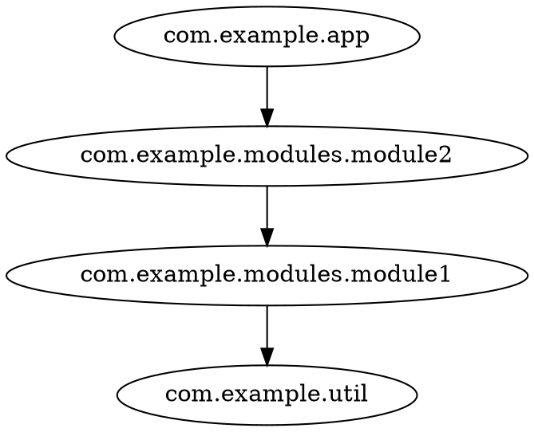

# codeps

codeps is a **code package dependency analyzer** for JVM projects (Java and Scala).
It parses existing compiler output — [SemanticDB](https://scalameta.org/docs/semanticdb/specification.html) or `jdeps` — and produces a
**package-level dependency graph**, which you can export as [DOT](/howtos/exporting.html), [JSON](/howtos/exporting.html) or [Mermaid](/howtos/exporting.html).

No build-system integration needed: your local build tools already produce the inputs —
`.semanticdb` files from a Scala compiler with SemanticDB enabled, and `.class` files for the JDK's `jdeps` —
codeps just reads them.

> **New here?** Start with the [Quickstart](/tutorials/quickstart.html).
> Want to explore a graph interactively? Try the [interactive demo](/demo/cytoscape-graph.html) — it loads graphs exported with `-f json`.

## Features

- **Two input formats:**
  - [SemanticDB](/howtos/semdb.html) — detailed, from Scala compiler output (`.semanticdb` files), with per-package file/class stats
  - [jdeps](/howtos/jdeps.html) — from the JDK's own `jdeps -verbose:package` output, no extra tooling needed
- **Filtering** — keep only packages matching `--include` patterns, drop noise with `--exclude` (e.g. `java.*`, `scala.*`)
- **Collapsing** — merge whole package subtrees with `--collapse` rules (`com.example.**`, `org.lib.*`)
- **Three export formats** — [DOT, JSON, Mermaid](/reference/export-formats.html)
- **Interactive demo** — a standalone [graph viewer](/demo/cytoscape-graph.html): layouts, filtering, degree analysis, package suggestions

## Quick example

```shell
java -jar codeps.jar semdb classes/META-INF/semanticdb -i com.example -f dot
```



## Site Map
- [Tutorials](/tutorials) — step-by-step guides to get things working
  - [{{ tut.label }}]({{ tut.url}})
  
- [How Tos](/howtos) — goal-oriented recipes for specific tasks
  - [{{ tut.label }}]({{ tut.url}})
  
- [Reference](/reference) — complete descriptions of commands, config, and internals
  - [{{ tut.label }}]({{ tut.url}})
  

## Demo

[Open the interactive graph demo](/demo/cytoscape-graph.html) — drop a JSON graph (as exported by `-f json`) onto the page, then filter, focus and analyze packages.
