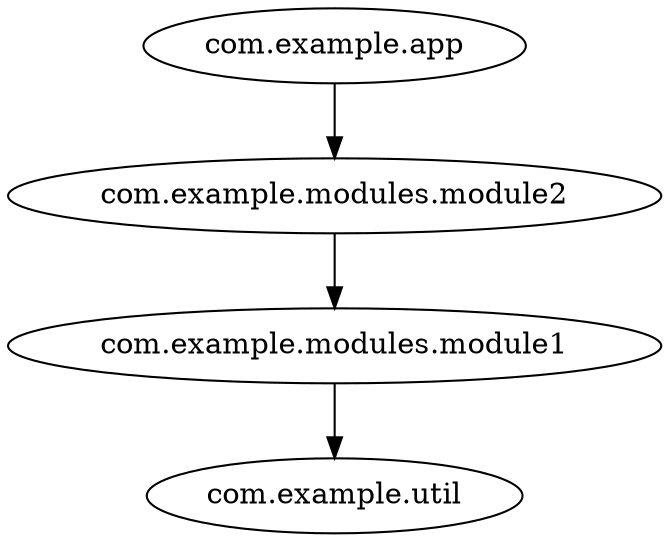

# codeps

codeps is a **code dependency analyzer** for JVM projects (Java and Scala).
It works in two steps: `codeps export` parses existing compiler output —
[SemanticDB](https://scalameta.org/docs/semanticdb/specification.html) or `jdeps` —
into a [common JSON graph format](/reference/json-input.html); then `codeps draw`
renders it as [DOT or Mermaid](/reference/export-formats.html) at any granularity
(package, file, type or member), and `codeps report` emits a multi-level
[cycle analysis report](/reference/report.html) with grades and suggestions.

No build-system integration needed: your local build tools already produce the inputs —
`.semanticdb` files from a Scala compiler with SemanticDB enabled, and `.class` files for the JDK's `jdeps` —
codeps just reads them.

> **New here?** Start with the [Quickstart](/tutorials/quickstart.html).
> Want to explore a graph interactively? Try the [interactive demo](/demo/cytoscape-graph.html) — it loads graphs produced by `codeps export` and analysis reports from `codeps report`.

## Features

- **Two input formats:**
  - [SemanticDB](/howtos/semdb.html) — detailed, from Scala compiler output (`.semanticdb` files): package/file/type/member nodes
  - [jdeps](/howtos/jdeps.html) — from the JDK's own `jdeps -verbose:class` output, no extra tooling needed
- **Four granularities** — render the graph at `package`, `file`, `type` or `member` level with `-g`
- **Cycle analysis** — `codeps report` grades every cycle at every granularity (`bad` / `meh` / `fine`) with suggestions what to fix
- **Filtering** — keep only nodes matching `--include` patterns, drop noise with `--exclude` (e.g. `java.*`, `scala.*`)
- **Collapsing** — merge whole subtrees with `--collapse` rules (`com.example.**`, `org.lib.*`)
- **Two output formats** — [DOT and Mermaid](/reference/export-formats.html)
- **Interactive demo** — a standalone [graph viewer](/demo/cytoscape-graph.html): layouts, filtering, degree analysis, cycle highlighting, package suggestions

## Quick example

```shell
codeps export --from semanticdb classes/META-INF/semanticdb | codeps draw -g package -f dot -
```




## Site Map
- [Tutorials](/tutorials) — step-by-step guides to get things working
  - [{{ tut.label }}]({{ tut.url}})
  
- [How Tos](/howtos) — goal-oriented recipes for specific tasks
  - [{{ tut.label }}]({{ tut.url}})
  
- [Reference](/reference) — complete descriptions of commands, config, and internals
  - [{{ tut.label }}]({{ tut.url}})
  

## Demo

[Open the interactive graph demo](/demo/cytoscape-graph.html) — drop a graph JSON (as produced by `codeps export`)
or an analysis report (from `codeps report`) onto the page, then filter, focus and analyze packages; report mode
highlights cycle edges, grades them and lists suggestions.
