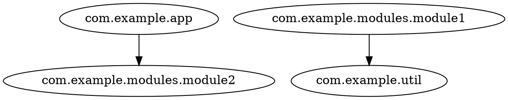

# Export formats

`codeps draw` renders the final graph in two formats: `-f dot` and `-f mermaid`.
The graph's nodes are whatever `-g` granularity produced, after
[filtering and collapsing](/reference/cli.html); edges are directed dependencies
(self-loops removed, deduplicated).

## DOT

Rendered by `DotExporter`. Graphviz `digraph` with quoted node ids:



- edges are sorted by `(source, target)`
- isolated vertices (no edges) are emitted as standalone lines
- quotes and backslashes inside ids are escaped
- when the graph contains cycles, a comment line lists them right after the header:
  `// cycles: a -> c -> b -> a` — each cycle is a closed loop in actual dependency
  order (the arrows are real edges); multiple cycles are comma-separated

Render it with Graphviz:

```shell
codeps export --from semanticdb classes/META-INF/semanticdb -o deps.json
codeps draw -g package -f dot deps.json -o graph.dot
dot -Tsvg graph.dot -o graph.svg
```

## Mermaid

Rendered by `MermaidExporter`. `flowchart LR` with **aliased node ids** (`N0`, `N1`, ...)
because Mermaid ids break on dots:


Nodes are listed first (sorted, each with its `N<i>` alias and quoted label),
then edges as `N<i> --> N<j>` (sorted by source/target). When the graph contains
cycles, a comment line lists them right after the header, e.g. `%% cycles: a -> c -> b -> a`.

Paste into any Mermaid renderer, or embed in Markdown:

````markdown

````
