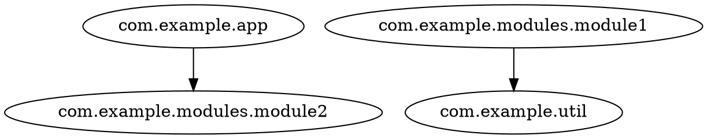
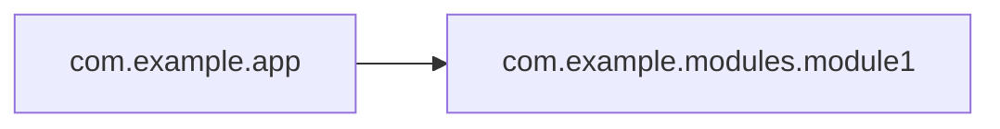

# Export formats

All exporters receive the final graph: nodes = packages after
[filtering and collapsing](/reference/cli.html), edges = package dependencies (self-edges removed, deduplicated).

## DOT

Rendered by `DotExporter`. Graphviz `digraph` with quoted node ids:



- edges are sorted by `(source, target)`
- isolated vertices (no edges) are emitted as standalone lines
- quotes and backslashes inside package names are escaped
- when the graph contains cycles, a comment line lists them right after the header:
  `// cycles: a -> c -> b -> a` — each cycle is a closed loop in actual dependency
  order (the arrows are real edges); multiple cycles are comma-separated

Render it with Graphviz:

```shell
java -jar codeps.jar semdb classes/META-INF/semanticdb -i com.example -f dot -o graph.dot
dot -Tsvg graph.dot -o graph.svg
```

## JSON

Rendered by `JsonExporter`. Shape:

```json
{
  "nodes": ["com.example.app", "com.example.modules.module1"],
  "edges": [["com.example.app", "com.example.modules.module2"]],
  "cycles": [],
  "nodeInfo": {
    "com.example.app": {"files": 1, "classes": 1}
  }
}
```

- `nodes` — sorted package names
- `edges` — `[source, target]` pairs, sorted
- `cycles` — one representative cycle per strongly connected component (size ≥ 2),
  as a **closed loop in actual dependency order**: `["a", "c", "b", "a"]` means
  `a -> c -> b -> a`; the first package is repeated at the end. Each cycle starts
  from its lexicographically smallest member; cycles are sorted by it. Always present
  (`[]` when the graph is acyclic). A component containing several cycles
  (e.g. `a <-> b <-> c`) reports a single representative cycle.
- `nodeInfo` — per-package `{files, classes}` stats; present only for SemanticDB input
  (jdeps output carries no file/class info), and only for nodes with known stats

This is the input format of the [interactive demo](/demo/cytoscape-graph.html).

## Mermaid

Rendered by `MermaidExporter`. `flowchart LR` with **aliased node ids** (`N0`, `N1`, ...)
because Mermaid ids break on dots:



Nodes are listed first (sorted, each with its `N<i>` alias and quoted label),
then edges as `N<i> --> N<j>` (sorted by source/target). When the graph contains
cycles, a comment line lists them right after the header, e.g. `%% cycles: a -> c -> b -> a`.

Paste into any Mermaid renderer, or embed in Markdown:

````markdown

````
