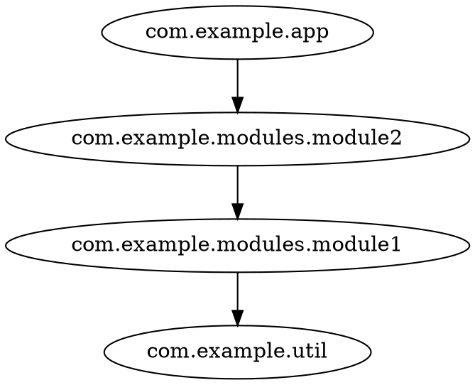

# Quickstart

## Prerequisites

- JDK 11+ (Scala 3 projects need a recent JDK anyway)
- [deder](https://sake92.github.io/deder/tutorials/installation.html) build tool (this project is built with it)

## Get the code

```shell
git clone https://github.com/sake92/codeps.git
cd codeps
```

## Generate analysis input

codeps reads what your compiler already produced — no build integration required.

**Scala** — compile with SemanticDB enabled (here with scala-cli):

```shell
scala-cli compile --server=false --semanticdb -d classes src/
# -> classes/META-INF/semanticdb/**/*.semanticdb
```

**Java or mixed** — use the JDK's own analyzer:

```shell
jdeps -verbose:package -filter:none -cp classes classes > jdeps.txt
```

See [SemanticDB analysis](/howtos/semdb.html) and [jdeps analysis](/howtos/jdeps.html) for details.

## Analyze

Run the CLI with deder:

```shell
# SemanticDB input: point at the directory containing *.semanticdb files
deder exec -t run -m cli semdb classes/META-INF/semanticdb -i com.example -f dot

# jdeps input: point at the jdeps output file
deder exec -t run -m cli jdeps jdeps.txt -i com.example -f dot
```

Both print the dependency graph to stdout. Example output:



## Visualize

Export as JSON and open it in the [interactive demo](/demo/cytoscape-graph.html):

```shell
deder exec -t run -m cli semdb classes/META-INF/semanticdb -i com.example -f json -o graph.json
```

Then open the demo page and **drop `graph.json`** onto it (or use *Paste* / *Load*).

## What's next?

- Filter and collapse packages: [CLI reference](/reference/cli.html)
- Export to other formats: [Exporting graphs](/howtos/exporting.html)
- Understand the internals: [Architecture](/reference/architecture.html)
