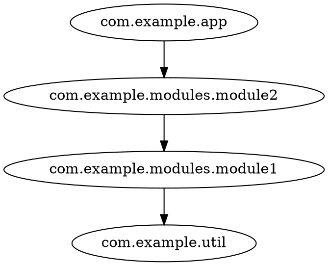

# Quickstart

## Prerequisites

- JDK 11+ (Scala 3 projects need a recent JDK anyway)

## Get the CLI

```shell
curl -L -o codeps.jar https://github.com/sake92/codeps/releases/download/main/codeps-cli-main.jar
```

## Generate analysis input

codeps reads what your compiler already produced — no build integration required.
Your normal local build already creates the inputs: `.semanticdb` files (if SemanticDB is enabled)
and compiled `.class` files.

**Scala** — compile with SemanticDB enabled (here with scala-cli):

```shell
scala-cli compile --server=false --semanticdb -d classes src/
# -> classes/META-INF/semanticdb/**/*.semanticdb
```

If your build tool already enables SemanticDB (e.g. sbt/Maven with the `semanticdb` compiler plugin),
the `.semanticdb` files are already on disk — you only need to point codeps at the directory that contains them.

**Java or mixed** — use the JDK's own analyzer:

```shell
jdeps -verbose:package -filter:none -cp classes classes > jdeps.txt
```

Your build already produced the `.class` files; `jdeps` ships with every JDK, so there is nothing extra to install.

See [SemanticDB analysis](/howtos/semdb.html) and [jdeps analysis](/howtos/jdeps.html) for details.

## Analyze

Run the CLI:

```shell
# SemanticDB input: point at the directory containing *.semanticdb files
java -jar codeps.jar semdb classes/META-INF/semanticdb -i com.example -f dot

# jdeps input: point at the jdeps output file
java -jar codeps.jar jdeps jdeps.txt -i com.example -f dot
```

Both print the dependency graph to stdout. Example output:



## Visualize

Export as JSON and open it in the [interactive demo](/demo/cytoscape-graph.html):

```shell
java -jar codeps.jar semdb classes/META-INF/semanticdb -i com.example -f json -o graph.json
```

Then open the demo page and **drop `graph.json`** onto it (or use *Paste* / *Load*).

## What's next?

- Filter and collapse packages: [CLI reference](/reference/cli.html)
- Export to other formats: [Exporting graphs](/howtos/exporting.html)
- Understand the internals: [Architecture](/reference/architecture.html)
