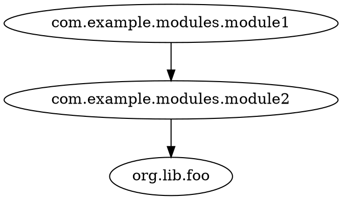

# codeps — package dependency analyzer

Date: 2026-08-05

## Overview

`codeps` is a CLI tool that analyzes package-level dependencies of a codebase and
renders them as a graph. It accepts two input kinds:

- folders with SemanticDB protobuf files (`.semanticdb`), and
- text output of the JDK's `jdeps` tool (`jdeps -verbose:package`).

It produces a directed graph where nodes are packages and an edge `A -> B` means
"some symbol in package A references some symbol in package B, in any way"
(imports, calls, type references, inheritance, annotations, ...).

The graph can be filtered (whitelist `--include`, blacklist `--exclude`),
collapsed (merge sub-packages per rules), and exported as DOT, JSON, or Mermaid.

## Tech stack

- Scala 3 (3.7.4)
- Deder as build tool (config-based, `deder.pkl`)
- JGraphT (`org.jgrapht:jgrapht-core:1.5.3`) for graph handling
- `org.scalameta::semanticdb-shared:4.17.2` for SemanticDB protobuf parsing
- `com.lihaoyi::mainargs:0.7.8` for CLI parsing
- `com.lihaoyi::os-lib:0.11.8` for file walking/operations
- `org.scalameta::munit:1.3.4` for tests

Environment: JDK 21+ (Deder server requirement), `scala-cli` and `jdeps`
available at build/test time.

## Architecture

Multi-module Deder project. Each layer is a separate module with a single
purpose, communicating through the shared model in `core`.

```
                          ┌─────────────────────┐
   .semanticdb files ───▶ │ parser-semanticdb   │──┐
                          └─────────────────────┘  │
                          ┌─────────────────────┐  │  PackageEdge
   jdeps text files ────▶ │ parser-jdeps        │──┼────────┐
                          └─────────────────────┘  │        ▼
                                                  │   ┌────────────┐
                                                  │   │   core     │
                                                  │   │ model+graph│
                                                  │   └────────────┘
                                                  │        ▼
                          ┌─────────────────────┐  │  collapsed graph
                          │ export              │◀─┘        │
                          │ dot / json / mermaid│◀──────────┘
                          └─────────────────────┘
                                   ▲
                          ┌────────┴────────┐
                          │ cli (mainargs)  │  codeps semdb|jdeps <inputs> ...
                          └─────────────────┘
```

### Module layout

```
core/src/ba/sake/codeps/
  model/PackageEdge.scala        # shared data type
  model/CollapseRule.scala       # enum: Wild(prefix) | SingleLevel(prefix)
  graph/GraphBuilder.scala       # edges → JGraphT DirectedGraph
  graph/Collapser.scala          # collapse rules applied to graph
  graph/Filter.scala             # include/exclude universe filtering
parsers/semanticdb/src/ba/sake/codeps/semanticdb/SemanticDbParser.scala
parsers/jdeps/src/ba/sake/codeps/jdeps/JdepsParser.scala
export/src/ba/sake/codeps/export/
  DotExporter.scala
  JsonExporter.scala
  MermaidExporter.scala
cli/src/ba/sake/codeps/cli/Main.scala
```

Module dependencies:
- `parser-semanticdb`, `parser-jdeps` → `core`
- `export` → `core`
- `cli` → `core`, `parser-semanticdb`, `parser-jdeps`, `export`

Each main module has a corresponding test module (`<id>-test`) created via
Deder's `asTest()` pattern, depending on munit.

## Data model

```scala
// core
case class PackageEdge(source: String, target: String)

enum CollapseRule:
  case Wild(prefix: String)        // "com.example.**"
  case SingleLevel(prefix: String) // "org.lib.*"
```

A package is a dotted name (`com.example.modules.module1`). The empty package in
Scala (`_empty_`) is treated as a normal package name and included if it matches
the filters. Symbols without package info (`local0`, `<none>`) are skipped.

## Pipeline

1. **Parse** — collect all "own packages" (packages defined in the input) and
   raw `PackageEdge`s.
2. **Filter** — the node universe is exactly the packages matching `--include`
   patterns (whitelist; required flag), minus packages matching `--exclude`
   (blacklist; wins over include). Edges are kept only when **both** endpoints
   are in the final universe. Self-edges (`A -> A`) are dropped. Duplicate
   edges are deduplicated (JGraphT directed graph has set semantics).
3. **Collapse** — merge nodes according to collapse rules (see below).
4. **Export** — render the collapsed graph in the requested format. Export is a
   pure view layer; it never mutates the graph.

Filters run before collapse; collapse can merge nodes that were distinct under
the filters (by design).

## Filters

- `--include <pkg>` (required, repeatable): whitelist. The node universe
  consists only of packages matching any include pattern. A pattern `ba.sake`
  matches `ba.sake` itself and everything below it. There is no default
  "analyze everything" mode.
- `--exclude <pkg>` (optional, repeatable): removes matching packages from the
  universe (pattern matches package + all sub-packages). Exclude wins over
  include.

Example: `--include ba.sake --exclude ba.sake.idontcare` → analyze the whole
`ba.sake` tree except the `idontcare` subtree and its dependents.

## Collapse rules

Collapse is output grouping: all packages are parsed, then merged at render
time. Multiple rules may be given; they are matched by longest prefix, first
match wins. Only trailing wildcards are supported.

| Rule               | Package               | Result          |
|--------------------|-----------------------|-----------------|
| `com.example.**`   | `com.example.foo`     | `com.example`   |
| `com.example.**`   | `com.example.bar.baz` | `com.example`   |
| `org.lib.*`        | `org.lib.foo.bar`     | `org.lib.foo`   |
| `org.lib.*`        | `org.lib.baz.qux.x`   | `org.lib.baz`   |
| (no rule matches)  | `a.b.c.d`             | `a.b.c.d`       |

- `**` (Wild): everything below the prefix collapses into the prefix.
- `*` (SingleLevel): packages below the prefix collapse into the next level
  below the prefix.

After collapsing, edges are re-derived from the collapsed node names and
deduplicated. A package with no edges after collapse is rendered as an isolated
vertex.

## Parsing

### SemanticDB

Files: `.semanticdb` protobuf payloads (`TextDocuments`). Parsed via
`scala.meta.internal.semanticdb.TextDocuments.parseFrom`.

Per document:
1. Derive the document's own package from its symbols / URI
   (e.g. symbol `com/example/Foo#` → package `com.example`).
2. For each occurrence referencing a symbol, extract the referenced package
   from the referenced symbol's owner chain.
3. If referenced package ≠ own package, emit `PackageEdge(ownPkg, refPkg)`.

### jdeps

Input: text output of `jdeps -verbose:package` (package-level). Top-level lines
have the form `pkg.a -> pkg.b`; indented lines beneath them are class-level
detail and are skipped, as are blank lines and `not found` lines.

Per line:
1. Match non-indented `X -> Y` lines only.
2. Emit `PackageEdge(X, Y)`.

Both parsers produce the same `PackageEdge` type; core/export logic is
parser-agnostic.

## CLI

mainargs-based. Two subcommands; one format per invocation.

```
codeps semdb <dirs...> --include <pkg>... [--exclude <pkg>...] [--collapse <rule>...] -f <dot|json|mermaid> [-o <file>]
codeps jdeps <files...> --include <pkg>... [--exclude <pkg>...] [--collapse <rule>...] -f <dot|json|mermaid> [-o <file>]
```

- `<dirs...>` — directories; semdb walks recursively for `.semanticdb` files
  (os-lib).
- `<files...>` — jdeps text files (os-lib).
- `--include` — required, repeatable whitelist.
- `--exclude` — optional, repeatable.
- `--collapse` — optional, repeatable; trailing `**` or `*`.
- `-f`/`--format` — required enum `dot | json | mermaid`.
- `-o` — optional output file; stdout when absent.

Entry point: `ba.sake.codeps.cli.Main`. Run via
`deder exec -t run -m cli -- semdb ...`; distributable via
`deder exec -t assembly -m cli`.

## Export formats

All exporters consume the same collapsed graph.

**DOT** (`-f dot`), hand-rolled:



Quoted, escaped node names; one edge per line.

**JSON** (`-f json`):

```json
{
  "nodes": ["com.example.a", "com.example.b"],
  "edges": [["com.example.a", "com.example.b"]]
}
```

**Mermaid** (`-f mermaid`):

```
flowchart LR
  A["com.example.a"] --> B["com.example.b"]
```

Node IDs aliased (`A`, `B`, ...) because mermaid IDs break on dots; labels stay
fully readable.

## Error handling

| Situation                | Behavior                                        |
|--------------------------|-------------------------------------------------|
| Malformed `.semanticdb`  | warning with file path, skip file, continue     |
| Unreadable file          | warning, skip                                   |
| Empty result after filter| message to stderr, exit code 1, no output file  |
| Bad format flag          | mainargs usage error                            |
| Nonexistent input path   | error, exit code 1 (fail-fast)                  |

## Testing

Framework: munit. Pure logic specs use no filesystem.

- `CollapserSpec` — rule resolution table (`**` vs `*` vs no-match), multiple
  rules, longest-prefix wins.
- `FilterSpec` — include-only universe, exclude-over-include, edge dropping
  when an endpoint is filtered out, self-edge removal, dedup.
- `GraphBuilderSpec` — graph built from edges, isolated vertices preserved.
- `SemanticDbParserSpec` — real compiled fixtures (below); plus a corrupt-bytes
  case → warn + skip.
- `JdepsParserSpec` — real `jdeps` output (below); plus malformed-line cases.
- `ExportSpec` — golden strings for dot/json/mermaid on a known small graph,
  including mermaid alias assignment and DOT quoting.
- `CliSpec` — 2-3 smoke tests on a temp-dir copy: run main, assert exit code
  and output.

### Fixtures

Real, compiler-generated fixtures, not hand-crafted bytes. Not checked in —
generated at test time.

1. `test/resources/examples/example1/` (repo root, checked in): Scala source
   files with a realistic package structure and cross-package dependencies.
2. Test setup (once per run, shared by all tests):
   ```
   copy test/resources/examples/example1 → tmp/examples/example1
   scala-cli compile --semanticdb -d tmp/examples/example1/classes tmp/examples/example1
   jdeps -verbose:package -filter:none -cp classes classes > tmp/examples/example1/jdeps.txt
   ```
3. `tmp/` is at the repo root, gitignored, never cleaned up (so it can be
   inspected). Compilation happens once per run; tests consume the cache.

## Build config

`deder.pkl` follows Deder's `ScalaModule`/`asTest()` pattern. Main modules:
`core`, `parser-semanticdb`, `parser-jdeps`, `export`, `cli` (with
`mainClass = "ba.sake.codeps.cli.Main"`). Test modules: `core-test`,
`parser-semanticdb-test`, `parser-jdeps-test`, `export-test`, `cli-test`,
each with munit 1.3.4.

`.gitignore`: `tmp/`, `.deder/`, `.bsp/`.

## Out of scope (now)

- Other input kinds (sbt, scalac, ...) — future subcommands.
- Middle-level wildcards in collapse rules.
- Config files — CLI flags only.
- Edge weights / reference counts.
